# Controller Class Diagram Description

이 문서는 `com.ch4.lumia_backend.controller` 패키지의 컨트롤러 계층을 기준으로 작성한 클래스 다이어그램 및 클래스별 설명이다.

## 1. Controller Class Diagram

```mermaid
classDiagram
    class UserController {
        -Logger logger
        -UserService userService
        -JwtUtil jwtUtil
        -UserSettingService userSettingService
        -RefreshTokenService refreshTokenService
        +login(LoginRequestDto) ResponseEntity
        +signup(SignupRequestDto) ResponseEntity
        +refreshToken(RefreshTokenRequestDto) ResponseEntity
        +logoutUser() ResponseEntity
        +getUserSettings() ResponseEntity
        +updateUserSettings(UserSettingDto) ResponseEntity
        +getUserProfile() ResponseEntity
        +updateUserProfile(UserProfileUpdateRequestDto) ResponseEntity
        +updateUserEmail(EmailUpdateRequestDto) ResponseEntity
        +updateUserPassword(PasswordUpdateRequestDto) ResponseEntity
        +findIdByEmail(String) ResponseEntity
        +updateUserEquippedItems(EquippedItemsUpdateRequestDto) ResponseEntity
        +updateUserCoins(CoinUpdateRequestDto) ResponseEntity
    }

    class PostController {
        -Logger logger
        -PostService postService
        -UserService userService
        -RestTemplate restTemplate
        -String FASTAPI_URL
        +getPosts(int, int) ResponseEntity
        +createPost(PostRequestDto) ResponseEntity
        +getPostDetail(Long) ResponseEntity
        +updatePost(Long, PostRequestDto) ResponseEntity
        +deletePost(Long) ResponseEntity
    }

    class CommentController {
        -Logger logger
        -RestTemplate restTemplate
        -String FASTAPI_URL
        -CommentService commentService
        +getComments(Long) ResponseEntity
        +createComment(Long, CommentRequestDto) ResponseEntity
        +updateComment(Long, CommentRequestDto) ResponseEntity
        +deleteComment(Long) ResponseEntity
    }

    class AnswerController {
        -Logger logger
        -AnswerService answerService
        -getCurrentUserId() String
        +saveAnswer(AnswerRequestDto) ResponseEntity
        +getMyRecords(Pageable) ResponseEntity
    }

    class QuestionController {
        -Logger logger
        -QuestionService questionService
        -getCurrentUserId() String
        +getQuestionForCurrentUser() ResponseEntity
        +getOnDemandQuestion() ResponseEntity
    }

    class ChatController {
        -Logger logger
        -ChatService chatService
        +createCompletion(ChatCompletionRequestDto) ResponseEntity
        -getCurrentUserId() String
    }

    class StoreController {
        -StoreService storeService
        +purchaseItem(PurchaseRequestDto) ResponseEntity
    }

    class UserService
    class UserSettingService
    class RefreshTokenService
    class JwtUtil
    class PostService
    class CommentService
    class AnswerService
    class QuestionService
    class ChatService
    class StoreService
    class RestTemplate
    class SecurityContextHolder

    UserController --> UserService : uses
    UserController --> JwtUtil : creates access token
    UserController --> UserSettingService : manages settings
    UserController --> RefreshTokenService : manages refresh token
    UserController ..> SecurityContextHolder : reads authentication

    PostController --> PostService : uses
    PostController --> UserService : finds current user
    PostController --> RestTemplate : calls content filter API
    PostController ..> SecurityContextHolder : reads authentication

    CommentController --> CommentService : uses
    CommentController --> RestTemplate : calls content filter API
    CommentController ..> SecurityContextHolder : reads authentication

    AnswerController --> AnswerService : uses
    AnswerController ..> SecurityContextHolder : reads authentication

    QuestionController --> QuestionService : uses
    QuestionController ..> SecurityContextHolder : reads authentication

    ChatController --> ChatService : uses
    ChatController ..> SecurityContextHolder : reads authentication

    StoreController --> StoreService : uses
    StoreController ..> SecurityContextHolder : reads authentication
```

## 2. Class Descriptions

### 2.1 UserController

| 구분 | 내용 |
|---|---|
| 패키지 | `com.ch4.lumia_backend.controller` |
| 역할 | 사용자 인증, 회원가입, 토큰 재발급, 로그아웃, 사용자 설정, 프로필, 이메일, 비밀번호, 장착 아이템, 코인 변경을 처리하는 REST 컨트롤러 |
| 기본 URL | `/api/users` |
| 주요 어노테이션 | `@RestController`, `@RequestMapping("/api/users")`, `@RequiredArgsConstructor` |
| 속성 | `logger`: 로그 출력용 정적 로거 |
| 속성 | `userService`: 로그인, 회원가입, 프로필, 이메일, 비밀번호, 코인, 장착 아이템 관련 비즈니스 로직 호출 |
| 속성 | `jwtUtil`: 로그인 및 refresh token 재발급 시 access token 생성 |
| 속성 | `userSettingService`: 사용자 설정 조회 및 수정 처리 |
| 속성 | `refreshTokenService`: refresh token 생성, 조회, 검증, 삭제 처리 |
| 주요 메서드 | `login(LoginRequestDto)`: 사용자 ID와 비밀번호를 검증하고 access token 및 refresh token을 반환 |
| 주요 메서드 | `signup(SignupRequestDto)`: 회원가입 요청을 처리하고 생성된 사용자 ID를 반환 |
| 주요 메서드 | `refreshToken(RefreshTokenRequestDto)`: refresh token을 검증한 뒤 새로운 access token을 발급 |
| 주요 메서드 | `logoutUser()`: 현재 인증된 사용자의 refresh token을 삭제하고 security context를 초기화 |
| 주요 메서드 | `getUserSettings()`: 현재 로그인 사용자의 설정 정보 조회 |
| 주요 메서드 | `updateUserSettings(UserSettingDto)`: 현재 로그인 사용자의 설정 정보 수정 |
| 주요 메서드 | `getUserProfile()`: 현재 로그인 사용자의 프로필 조회 |
| 주요 메서드 | `updateUserProfile(UserProfileUpdateRequestDto)`: 현재 로그인 사용자의 프로필 수정 |
| 주요 메서드 | `updateUserEmail(EmailUpdateRequestDto)`: 현재 로그인 사용자의 이메일 변경 |
| 주요 메서드 | `updateUserPassword(PasswordUpdateRequestDto)`: 현재 로그인 사용자의 비밀번호 변경 |
| 주요 메서드 | `findIdByEmail(String)`: 이메일로 사용자 ID 찾기 |
| 주요 메서드 | `updateUserEquippedItems(EquippedItemsUpdateRequestDto)`: 장착 아이템 정보 변경 |
| 주요 메서드 | `updateUserCoins(CoinUpdateRequestDto)`: 코인 수량 변경 후 변경된 코인 값 반환 |
| 연결 관계 | `UserService`, `UserSettingService`, `RefreshTokenService`, `JwtUtil`에 의존 |
| 인증 처리 | 다수의 `/me/...` API에서 `SecurityContextHolder`를 통해 현재 사용자 ID를 가져오고, 미인증 사용자는 `401 UNAUTHORIZED` 반환 |
| 응답 형태 | 성공 시 DTO 또는 문자열/Map 반환, 실패 시 `ResponseEntity`로 HTTP 상태 코드와 오류 메시지 반환 |

### 2.2 PostController

| 구분 | 내용 |
|---|---|
| 패키지 | `com.ch4.lumia_backend.controller` |
| 역할 | 게시글 목록 조회, 작성, 상세 조회, 수정, 삭제를 처리하는 REST 컨트롤러 |
| 기본 URL | `/api/posts` |
| 주요 어노테이션 | `@RestController`, `@RequestMapping("/api/posts")`, `@RequiredArgsConstructor` |
| 속성 | `logger`: 게시글 처리 과정 로그 출력 |
| 속성 | `postService`: 게시글 조회, 생성, 수정, 삭제 비즈니스 로직 호출 |
| 속성 | `userService`: 현재 인증된 사용자 정보를 조회 |
| 속성 | `restTemplate`: 외부 FastAPI 필터 서버 호출 |
| 속성 | `FASTAPI_URL`: 게시글 제목/내용 필터링 API 주소 |
| 주요 메서드 | `getPosts(int page, int size)`: 게시글 목록을 페이지 단위로 조회하고 `Page<PostResponseDto>` 반환 |
| 주요 메서드 | `createPost(PostRequestDto)`: 인증 사용자 기준으로 게시글 작성, 작성 전 외부 필터 API 호출 |
| 주요 메서드 | `getPostDetail(Long id)`: 게시글 ID로 상세 정보 조회 |
| 주요 메서드 | `updatePost(Long id, PostRequestDto)`: 작성자 권한을 기반으로 게시글 수정, 수정 전 외부 필터 API 호출 |
| 주요 메서드 | `deletePost(Long id)`: 작성자 권한을 기반으로 게시글 삭제 |
| 연결 관계 | `PostService`를 통해 게시글 비즈니스 로직 수행 |
| 연결 관계 | `UserService`를 통해 인증된 사용자의 `User` 엔티티 조회 |
| 연결 관계 | `RestTemplate`을 통해 `FASTAPI_URL`의 컨텐츠 필터링 API 호출 |
| 인증 처리 | 작성, 수정, 삭제 API에서 `SecurityContextHolder`의 사용자 ID 확인 |
| 응답 형태 | 성공 시 `PostResponseDto`, `Page<PostResponseDto>`, 또는 `204 NO_CONTENT` 반환 |

### 2.3 CommentController

| 구분 | 내용 |
|---|---|
| 패키지 | `com.ch4.lumia_backend.controller` |
| 역할 | 특정 게시글의 댓글 조회, 댓글 작성, 수정, 삭제를 처리하는 REST 컨트롤러 |
| 기본 URL | 클래스 레벨 기본 URL 없음, 각 메서드에 전체 경로 지정 |
| 주요 어노테이션 | `@RestController`, `@RequiredArgsConstructor` |
| 속성 | `logger`: 댓글 처리 과정 로그 출력 |
| 속성 | `restTemplate`: 외부 FastAPI 필터 서버 호출 |
| 속성 | `FASTAPI_URL`: 댓글 내용 필터링 API 주소 |
| 속성 | `commentService`: 댓글 조회, 생성, 수정, 삭제 비즈니스 로직 호출 |
| 주요 메서드 | `getComments(Long postId)`: 특정 게시글의 댓글 목록 조회 후 `List<CommentResponseDto>` 반환 |
| 주요 메서드 | `createComment(Long postId, CommentRequestDto)`: 인증 사용자 기준 댓글 작성, 작성 전 외부 필터 API 호출 |
| 주요 메서드 | `updateComment(Long commentId, CommentRequestDto)`: 인증 사용자 기준 댓글 수정, 수정 전 외부 필터 API 호출 |
| 주요 메서드 | `deleteComment(Long commentId)`: 인증 사용자 기준 댓글 삭제 |
| 연결 관계 | `CommentService`를 통해 댓글 비즈니스 로직 수행 |
| 연결 관계 | `Post.fromId(postId)`를 사용해 댓글 작성 대상 게시글 참조 생성 |
| 연결 관계 | `RestTemplate`을 통해 `FASTAPI_URL`의 컨텐츠 필터링 API 호출 |
| 인증 처리 | 작성, 수정, 삭제 API에서 `SecurityContextHolder`의 사용자 ID 확인 |
| 응답 형태 | 성공 시 `CommentResponseDto`, `List<CommentResponseDto>`, 또는 삭제 성공 메시지 반환 |

### 2.4 AnswerController

| 구분 | 내용 |
|---|---|
| 패키지 | `com.ch4.lumia_backend.controller` |
| 역할 | 사용자의 질문 답변 저장 및 내 답변 기록 조회를 처리하는 REST 컨트롤러 |
| 기본 URL | `/api/answers` |
| 주요 어노테이션 | `@RestController`, `@RequestMapping("/api/answers")`, `@RequiredArgsConstructor` |
| 속성 | `logger`: 답변 처리 과정 로그 출력 |
| 속성 | `answerService`: 답변 저장 및 사용자 답변 기록 조회 비즈니스 로직 호출 |
| 주요 메서드 | `getCurrentUserId()`: `SecurityContextHolder`에서 현재 인증 사용자 ID를 추출, 미인증이면 `null` 반환 |
| 주요 메서드 | `saveAnswer(AnswerRequestDto)`: 인증 사용자 기준 답변 저장 후 `AnswerResponseDto` 반환 |
| 주요 메서드 | `getMyRecords(Pageable)`: 현재 사용자의 답변 기록을 페이지 단위로 조회 |
| 연결 관계 | `AnswerService`에 의존하여 답변 저장 및 조회 수행 |
| 인증 처리 | 모든 API에서 `getCurrentUserId()`를 통해 사용자 인증 여부 확인 |
| 응답 형태 | 성공 시 `AnswerResponseDto` 또는 `Page<AnswerResponseDto>` 반환 |

### 2.5 QuestionController

| 구분 | 내용 |
|---|---|
| 패키지 | `com.ch4.lumia_backend.controller` |
| 역할 | 사용자에게 제공할 질문을 조회하는 REST 컨트롤러 |
| 기본 URL | `/api/questions` |
| 주요 어노테이션 | `@RestController`, `@RequestMapping("/api/questions")`, `@RequiredArgsConstructor` |
| 속성 | `logger`: 질문 조회 과정 로그 출력 |
| 속성 | `questionService`: 예약 질문 및 즉시 질문 조회 비즈니스 로직 호출 |
| 주요 메서드 | `getCurrentUserId()`: 현재 인증된 사용자 ID를 `SecurityContextHolder`에서 추출 |
| 주요 메서드 | `getQuestionForCurrentUser()`: 현재 사용자에게 예약된 질문 조회 |
| 주요 메서드 | `getOnDemandQuestion()`: 현재 사용자에게 즉시 추가 질문 제공, 제한 초과 시 `429 TOO_MANY_REQUESTS` 반환 |
| 연결 관계 | `QuestionService`를 통해 질문 생성/조회 로직 수행 |
| 인증 처리 | 모든 질문 조회 API에서 로그인 사용자 여부 확인 |
| 응답 형태 | 성공 시 `NewMessageResponseDto` 반환 |

### 2.6 ChatController

| 구분 | 내용 |
|---|---|
| 패키지 | `com.ch4.lumia_backend.controller` |
| 역할 | 채팅 메시지를 받아 AI 응답 생성을 요청하는 REST 컨트롤러 |
| 기본 URL | `/api/chat` |
| 주요 어노테이션 | `@RestController`, `@RequestMapping("/api/chat")`, `@RequiredArgsConstructor` |
| 속성 | `logger`: 채팅 요청 및 오류 로그 출력 |
| 속성 | `chatService`: 채팅 응답 생성 비즈니스 로직 호출 |
| 주요 메서드 | `createCompletion(ChatCompletionRequestDto)`: 요청 메시지를 검증하고 `ChatService`에 응답 생성을 위임 |
| 주요 메서드 | `getCurrentUserId()`: 현재 인증된 사용자 ID를 조회, 익명 사용자는 `null` 반환 |
| 연결 관계 | `ChatService`를 통해 채팅 completion 생성 |
| 인증 처리 | 인증 사용자는 사용자 ID를 서비스에 전달하고, 미인증 사용자는 anonymous 요청으로 처리 |
| 예외 처리 | `IllegalArgumentException`, `ChatCompletionException`, 일반 `Exception`을 구분해 상태 코드 반환 |
| 응답 형태 | 성공 시 `ChatCompletionResponseDto` 반환 |

### 2.7 StoreController

| 구분 | 내용 |
|---|---|
| 패키지 | `com.ch4.lumia_backend.controller` |
| 역할 | 상점 아이템 구매 요청을 처리하는 REST 컨트롤러 |
| 기본 URL | `/api/store` |
| 주요 어노테이션 | `@RestController`, `@RequestMapping("/api/store")`, `@RequiredArgsConstructor` |
| 속성 | `storeService`: 아이템 구매 비즈니스 로직 호출 |
| 주요 메서드 | `purchaseItem(PurchaseRequestDto)`: 현재 인증 사용자 기준으로 아이템 구매 처리 |
| 연결 관계 | `StoreService`에 구매 처리를 위임 |
| 인증 처리 | `SecurityContextHolder`에서 현재 사용자 ID를 확인하고 미인증 사용자는 `401 UNAUTHORIZED` 반환 |
| 응답 형태 | 성공 시 구매 완료 메시지, 실패 시 `400 BAD_REQUEST` 또는 `500 INTERNAL_SERVER_ERROR` 반환 |

## 3. Controller Relationship Summary

| Controller | 연결 대상 | 관계 내용 |
|---|---|---|
| `UserController` | `UserService` | 로그인, 회원가입, 프로필, 이메일, 비밀번호, 코인, 장착 아이템 처리 위임 |
| `UserController` | `JwtUtil` | access token 생성 |
| `UserController` | `RefreshTokenService` | refresh token 생성, 검증, 삭제 |
| `UserController` | `UserSettingService` | 사용자 설정 조회 및 수정 |
| `PostController` | `PostService` | 게시글 CRUD 처리 위임 |
| `PostController` | `UserService` | 게시글 작성/수정/삭제 시 현재 사용자 엔티티 조회 |
| `PostController` | `RestTemplate` | 외부 FastAPI 컨텐츠 필터링 API 호출 |
| `CommentController` | `CommentService` | 댓글 CRUD 처리 위임 |
| `CommentController` | `RestTemplate` | 외부 FastAPI 컨텐츠 필터링 API 호출 |
| `AnswerController` | `AnswerService` | 답변 저장 및 내 답변 기록 조회 |
| `QuestionController` | `QuestionService` | 예약 질문 및 즉시 질문 조회 |
| `ChatController` | `ChatService` | 채팅 completion 응답 생성 |
| `StoreController` | `StoreService` | 아이템 구매 처리 |
| 모든 인증 필요 Controller | `SecurityContextHolder` | 현재 로그인 사용자 ID 조회 |
